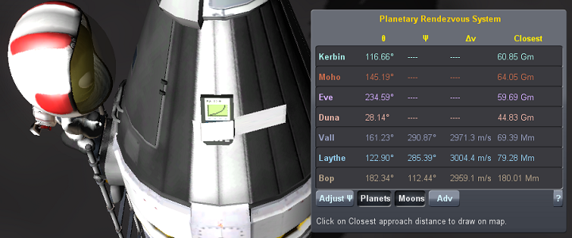
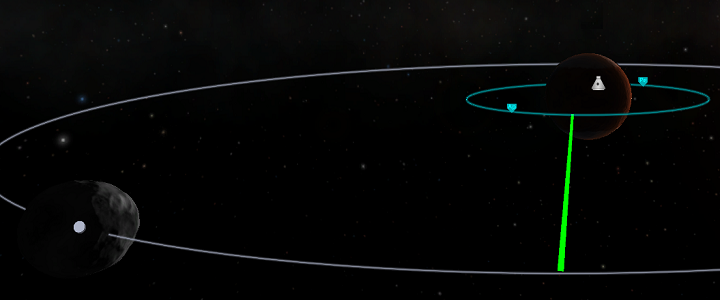

## Protractor Continued

**We're back! And Protractor is now ported to the presumably last ever version of KSP, so this should work as long as it's needed.**

To quote mrenigma03, the original creator of this mod:

"Miss your old TI calculator? Tired of guessing at rendezvous angles?

Well good news - Jeb taped his old calculator on the side of his ship with those nosy scientists on the ground being none the wiser!"

Protractor calculates optimal transfer window phase angles for interplanetary travel. When you're ready to leave for Duna, it tells you when to burn and in what direction. No more guessing.

Protractor is an old and dare I say, beloved by some, transfer window planner for Kerbal Space Program. It hadn't been updated in many years, but I just did. So it's back for the latest and last version of KSP!

### Media

*These are old videos from the original KSP Forums thread. It looks a bit cooler, few more things there, but it works about the same. And it's sort of KSP history.*

#### Tutorial video by Charlie Garcia

#### Tutorial Video by Hadlock

*Protractor was originally written by mrenigma03, who passed maintenance onto me many years ago. And I thank him for his original work. We appreciate him.*

*This version was then maintained by me, Michel Dusseault (with mrenigma03's blessing). Both contributions are **released under the [GPLv3](protractor/gpl.txt).***

Parts of it are also released under the [MIT](protractor/mit.txt) license, and the .netkan file is [CC-0](protractor/cc-0.txt). You may find complete licensing information in the [LICENSE](protractor/LICENSE) file.
